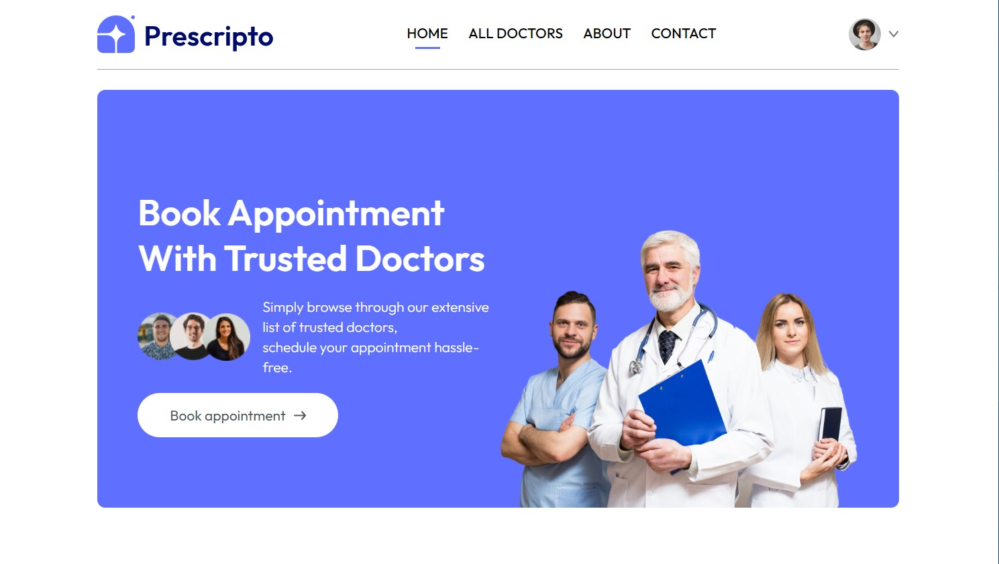
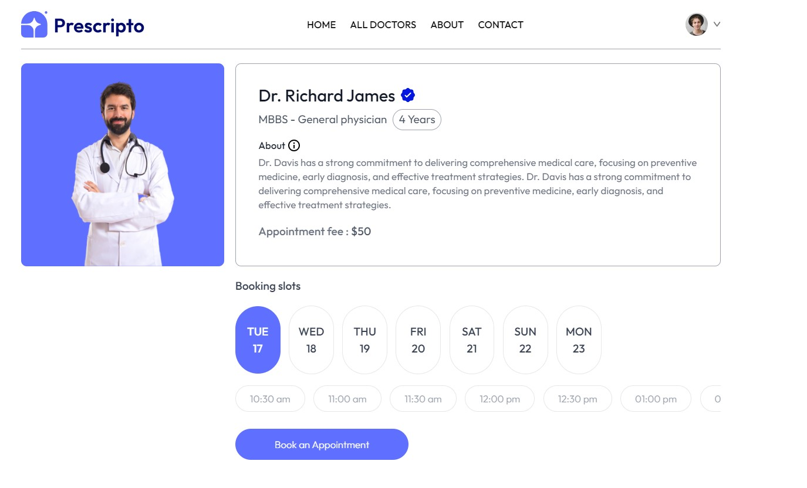
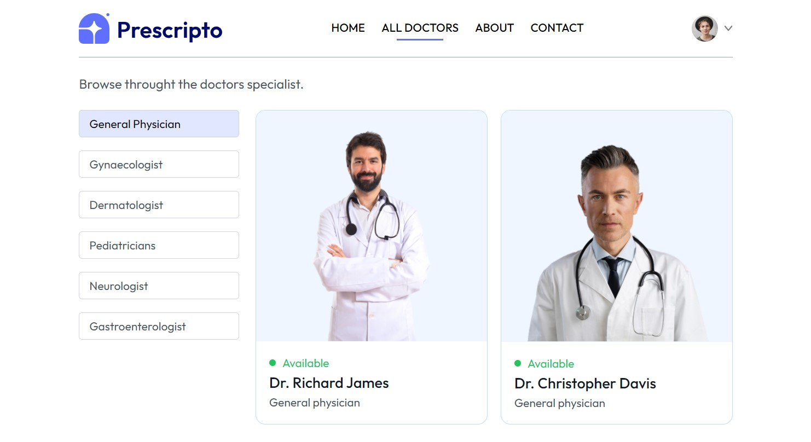

# Prescripto

Prescripto is a web application designed to simplify healthcare access. Patients can sign up, log in, browse through a list of doctors specializing in different fields, and book appointments effortlessly. The application is built using **React.js** for the frontend and **Tailwind CSS** for sleek and responsive styling.

## Features

- **User Authentication:** Patients can sign up and log in securely to access the platform.
- **Doctor Listings:** Browse a curated list of doctors across various specialties.
- **Appointment Booking:** Schedule an appointment with the doctor of your choice with a few simple clicks.
- **Responsive Design:** The application is fully responsive, ensuring a seamless experience on both desktop and mobile devices.

## Tech Stack

- **Frontend:** React.js
- **Styling:** Tailwind CSS
- **State Management:** React Hooks and Context API

## Installation

To get started with the project locally, follow these steps:

1. Clone the repository:
   ```bash
   git clone https://github.com/himjoshi95/prescripto.git
   ```
2. Navigate to the project directory:
    ```bash
   cd prescripto
   ```
3. Install the dependencies:
    ```bash
   npm install
   ```
4. Start the development server:
    ```bash
   npm run dev
   ```

## Folder Structure
.
├── public              # Public assets
├── src
│   ├── components      # Reusable UI components
│   ├── pages           # Application pages
│   ├── context         # Context API for state management│  
│   └── screenshots     # ScreenShots Available
└── README.md

## Screenshots


*Homepage: Explore a curated list of doctors from various specialties, complete with detailed profiles and booking options.*

*Appointment Booking: Select your preferred doctor and time.*

*All-Doctors: Browse available doctors.*

## Future Enhancements
1. Doctor Profiles: Detailed profiles with reviews and ratings.
2. Payment Integration: Secure payment options for online consultations.
3. Notifications: Email/SMS reminders for upcoming appointments.

## Contributing
Contributions are welcome! Feel free to open an issue or submit a pull request to improve Prescripto.
